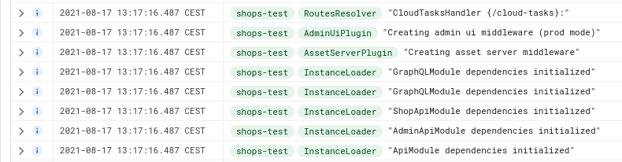

# :scroll: Changelog

### Aug 2021

1. Upgraded to `Vendure 1.2.0`
1. Using Google Cloud Tasks for worker jobs on a seperate instance.
1. Proper logging with Winston in Google Stackdriver 

### June 2021

1. Moved Vendure plugins to `https://github.com/martijnvdbrug/pinelab-vendure-plugins`
1. Upgraded to `Vendure 1.0.2`

### May 2021

1. Created Buefy storefront components, for more flexible webshop building.
1. Upgraded to `Vendure RC1`

### Apr 2021

1. Moved frontend stuff to `pinelab-storefront-client`
1. Upgraded to `Vendure beta5`

### Jan 2021

1. Using Gridsome for static storefront
1. Upgraded to 0.18.1
1. Added a webhook plugin to trigger Gridsome builds on configured events

### Dec 7 2020

1. SOLD OUT for products that are out of stock
1. Upgrade to Index 0.17.1  
   

### Nov 15 2020

1. Added Collections in storefront for grouping products
1. Added support for up to 5 images per product variant  
   
   

### Nov 1 2020

First shop live! :rocket:

### Oct 1 2020

Demo shop live. [Check it out](https://pinelab-demo-shop.netlify.app/)
