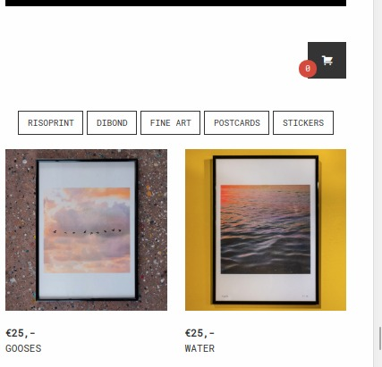
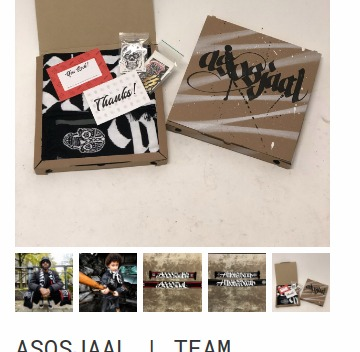

# Pinelab Shop
Pinelab believes ecommerce expertise can be for anyone. 
The Pinelab Shop provides all business owners an eCommerce platform, with all the best practices included, for selling online.
  
The Pinelab Shop is a multi-customer SaaS webshop built with Vendure and Angular. 
1. `storefront` contains the Angular storefront. This storefront is use in static hosted HTML files. 
An example can be found in `demo-shop/index.html`
1. `vendure` contains the vendure backend. The backend uses Vendure's channel feature to support multiple customers.

Visit [Pinelab.studio](https://pinelab.studio/webshop) for more info.

## :round_pushpin: Roadmap for january 2021
1. Export tax summary over given period 
1. Monthly email with metrics to Shop owners

## :scroll: Release notes

### Dec 7 2020
1. SOLD OUT for products that are out of stock
1. Upgrade to Vendure 0.17.1    

### Nov 15 2020
1. Added Collections in storefront for grouping products
1. Added support for up to 5 images per product variant   

### Nov 1 2020
First shop live! :rocket:

### Oct 1 2020
Demo shop live. [Check it out](https://pinelab-demo-shop.netlify.app/)